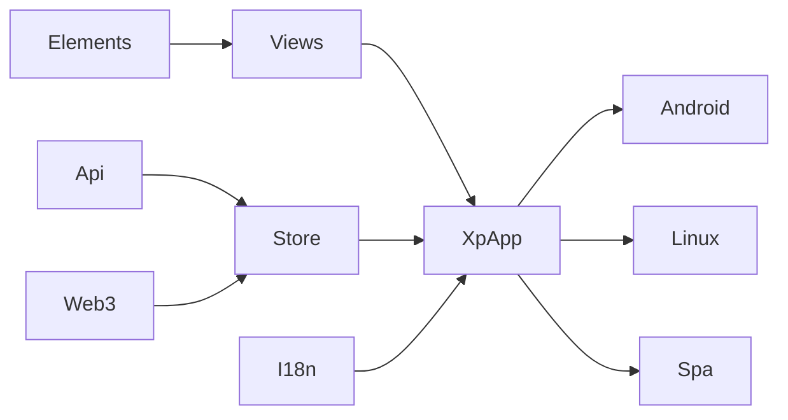
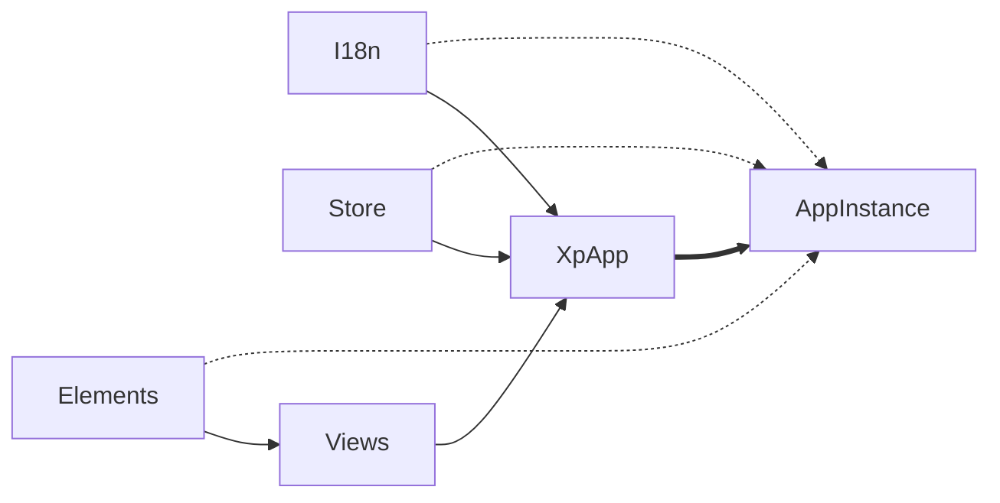
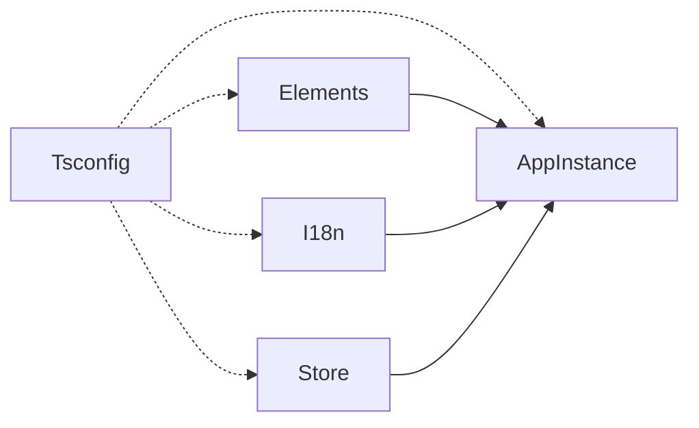

# Rn Vite Tauri Workshop

This monorepo is a workshop for building a cross platform applications with the following tech stack:

- React
- React Native
- Tamagui
- Tauri
- Vite

As with all other apps, the repo also consumes many support tools and non-structural libraries to build its features. Please check `package.json` of apps and packages to learn more.

## Structure

One of the aims of this workshop is to allow the cross-platform app to be able to target any operating system or environment it supports independently of any other.

All target apps consume the same cross-platform codebase. But, if the need arises, all platforms are capable of:

- Enabling and disabling cross-platform features.
- Including additional functionality such as splash screens and decorated window frames.
- Including unique drivers for common features of the cross-platform app.

Such granular control over a cross platform app necessitated a rather dispersed project structure. Standard approach used by TurboRepo was still a very good match for this complexity.

Here are the main package classes in the monorepo:

- `apps`: Operating system and environment targets for the cross platform app.
- `packages`: Components and libraries related to the app, here is a non-exhaustive list of the packages that may be involved:
  - State management
  - Api specifications and related tooling
  - Internationalization
  - React view libraries
  - Configuration providers

Please refer to the readme files in each package and app for further details on each.

## Package Diagrams

There is some variety in the life cycles and consumption domains of the packages in the app. This section uses some packages as examples to describe the distinctions that the devs should be aware of.

### Runtime Dependency graph

Here is a sample UML package diagram to exemplify one possible structure or the project. Please note that this graph is incomplete as this is a workshop that is in constant flux.

### Initialization Graph

While many libraries need some kind of initialization, some packages require these initializations to happen in their target apps rather than within the cross-platform app. This section is only concerned about the packages that require target app initialization.

Common reasons for target initialization are:

- A need to introduce target-specific defaults
- To enlist target-specific drivers
- Performance requirements

The graph below uses some common packages to show a possible target initialization graph.

Where `AppInstance` refers to any target, such as `android`, `spa`, or `windows`.

Dashed lines are for initialization targets while solid lines overlay the dependencies mentioned in the previous section. Please refer to the related packages for details about why some packages need to be initialized in their targets as opposed to being initialized in the cross platform-app.

## Configuration Graph

There is a lot of commonality in the configuration of packages and apps, to keep the code dry, the repo uses configuration packages to capture common properties. Admittedly this does increase the complexity of the repo a bit, but we decided to lean on dryness to aid uniformity in this repo.

Where `AppInstance` refers to any target, such as `android`, `spa`, or `windows`.

Dashed lines used for `Tsconfig` edges signify configuration targets. While solid lines overlay runtime dependencies.

## What's the aim of this repo?

Currently, none. It may end up becoming a repo template for some future projects. But as of now, this is purely an exploratory exercise.
